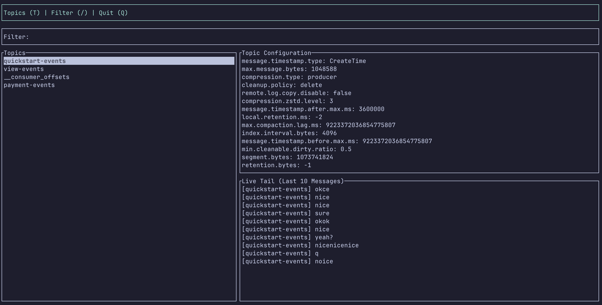

# Kafka TUI

A terminal user interface (TUI) for interacting with Apache Kafka clusters. This application provides a simple and intuitive way to browse topics, view configurations, and monitor messages in real-time.



## Features

- **Topic Browsing**: View all topics in your Kafka cluster
- **Topic Filtering**: Quickly find topics using the filter feature
- **Configuration Viewing**: See detailed configuration for each topic
- **Live Message Tailing**: Monitor messages in real-time as they arrive
- **Keyboard-Driven Interface**: Navigate efficiently using keyboard shortcuts

## Installation

### Prerequisites

- Rust and Cargo (install from [rustup.rs](https://rustup.rs/))
- Apache Kafka cluster (local or remote)

### Building from Source

1. Clone the repository:

   ```bash
   git clone https://github.com/shaneikennedy/ktui.git
   cd ktui
   ```

2. Build the application:

   ```bash
   cargo build --release
   ```

3. Run the application:
   ```bash
   cargo run --release
   ```

## Usage

### Connecting to Kafka

By default, the application connects to `localhost:9092`.

### Navigation

- **Up/Down Arrow Keys**: Navigate through topics or configuration items
- **Enter**: Select a topic to view its details
- **b**: Go back to the topics list from detail view
- **T**: Return to the topics view
- **Q**: Quit the application

### Filtering

- **/**: Enter filter mode
- **Type**: Filter topics as you type
- **Esc**: Exit filter mode

### Live Tailing

The application automatically tails the currently selected topic, showing the most recent messages in the bottom panel.

## Keyboard Shortcuts

| Key   | Action                         |
| ----- | ------------------------------ |
| ↑/↓   | Navigate through topics/config |
| Enter | Select topic/view details      |
| b     | Go back                        |
| T     | Return to topics view          |
| /     | Enter filter mode              |
| Esc   | Exit filter mode               |
| Q     | Quit application               |

## Acknowledgments

- [rdkafka](https://github.com/fede1024/rust-rdkafka) - Rust client for Apache Kafka
- [tui-rs](https://github.com/fdehau/tui-rs) - Terminal user interface library
- [crossterm](https://github.com/crossterm-rs/crossterm) - Cross-platform terminal manipulation library
